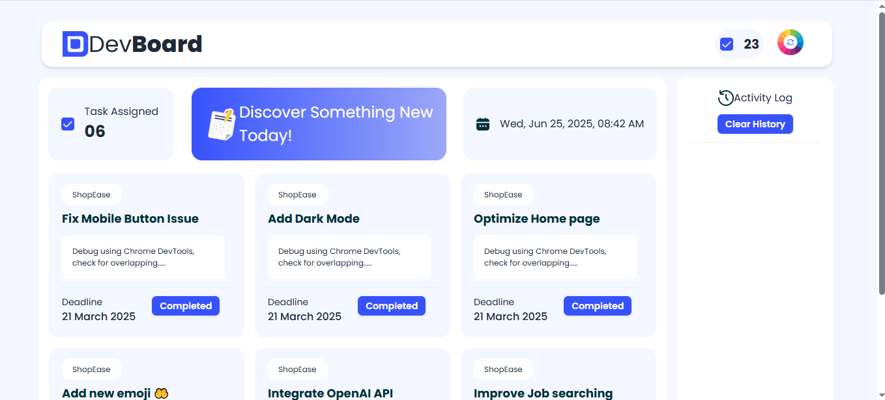

# 📋 DevBoard

**DevBoard** is a modern and minimalist task management web app that helps users organize tasks efficiently. Built with pure HTML, Tailwind CSS, and JavaScript — with a built-in **theme toggle feature** to switch between light and dark mode 🌗✨.

---

## 🔗 Live Demo

[Click Here to Visit](https://tawhide16.github.io/assignment-5/)

---

## 🧰 Tech Stack

- HTML5  
- Tailwind CSS  
- Vanilla JavaScript  
- Pure CSS (for smooth transitions)

---

## ✨ Features

- ✅ Add, delete, and manage tasks
- 🌗 Light/Dark theme toggle with a single click
- 📱 Fully responsive across mobile, tablet & desktop
- ⚡ Fast load speed with zero frameworks

---

## 📸 Screenshot



> Replace this with your actual screenshot file path

---

## 🚀 Run Locally

Clone the project

```bash
git clone https://github.com/Tawhide16/DevBoard.git
cd DevBoard
